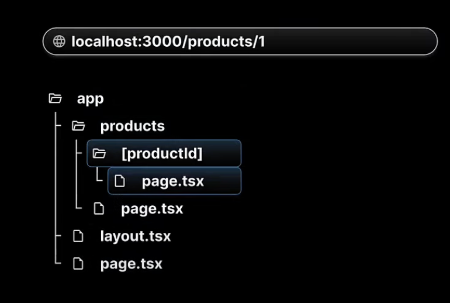
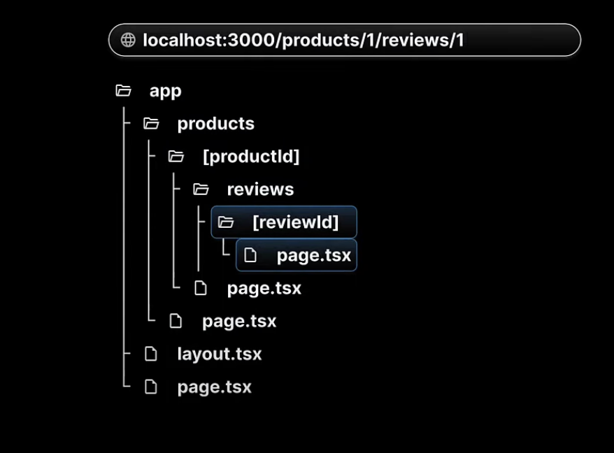
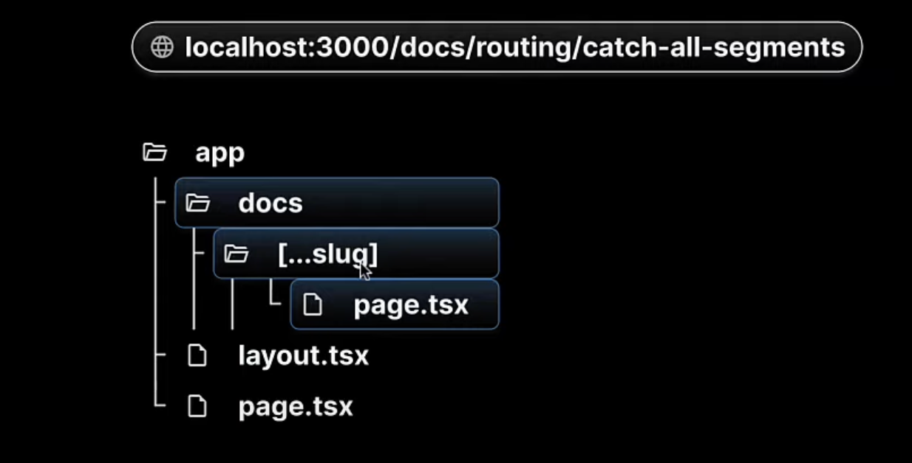
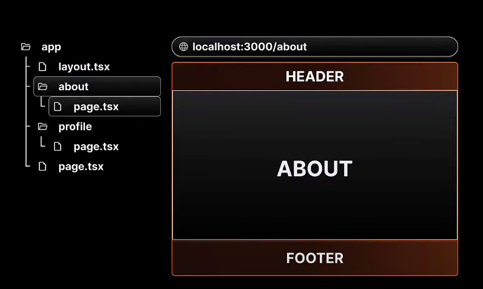
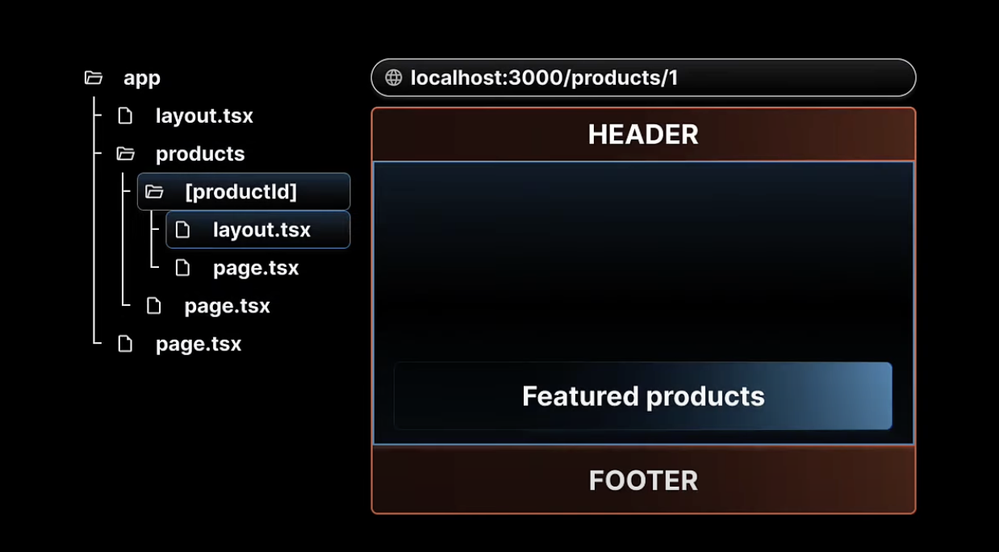

npx create-next-app@latest

npm run dev

React server components

1. Server component

- In Next.js all components are server components by default.
- They have the ability to run tasks like reading files or fetching data from database
- However, they don't have the ability to user hooks or handle user interactions

2. Client component

- To create a Client component, its necessary to add "use client" at the top of the component file
- Client component can't perform tasks like reading files, but they have the ability to use hooks and manage interactions

Next.js routing:

Next.js has a file-system based routing
Routing convention:

- All routes must be placed inside the app folder
- Every file that corresponds to a route must be named page.js or page.tsx
- Every folder corresponds to a path segment in the browser URL

✨ **Dynamic route:** ✨

✨ **Nested Dynamic route:** ✨

✨ **Catch-all segments:** ✨

Not found page:

- File name should be not-found.js in the app folder
- follow the product page with not-found.js file

File Colocation:

Private folder:

- create private folder using undersore previous its folder name
- For seperating UI logic from routing logic
- For consistently organizing internal files across a project
- For sorting and grouping files in code editors
- And finally, for avoiding potential naming conflicts with future Next.js file conventions
- A private folder indicates that it is a private implementation detail and should not be considered by the routing system
- The folder and all its subfolders are excluded from routing
- Prefix the folder name with an underscore
  Note: add '\_'= %5F to see the page in the url

Route Groups:

- Allows us to logically group our routes and project files withot affecting the URL path structure

- Authentication routes
  Register
  Login
  Forget password

For auth route add the auth folder in parentheses(auth)
And url will not include /auth it will be /login, /register, /forget-password

Layout:

- A page is UI that is unique to a route
- A layout is UI that is shared between multiple pages in the app
- like header, content, footer
- layout.js file is automatically created
- Add header and footer page in the layout file, and the {children} will be the page.js file content
- Header and footer will be there for all pages

Nested Layouts:

